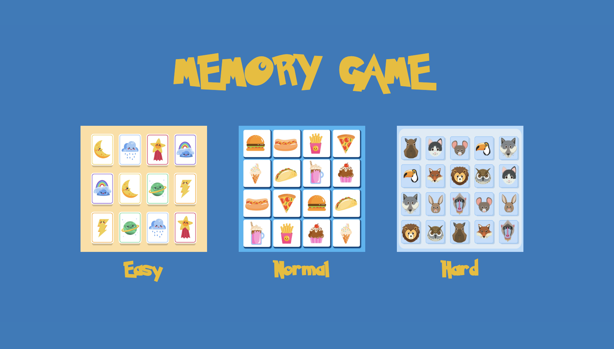
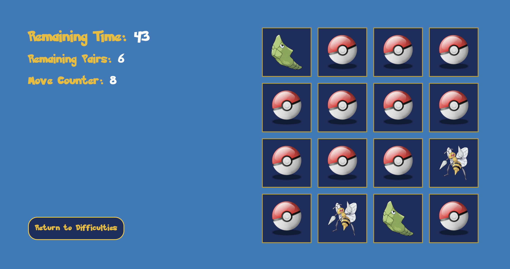
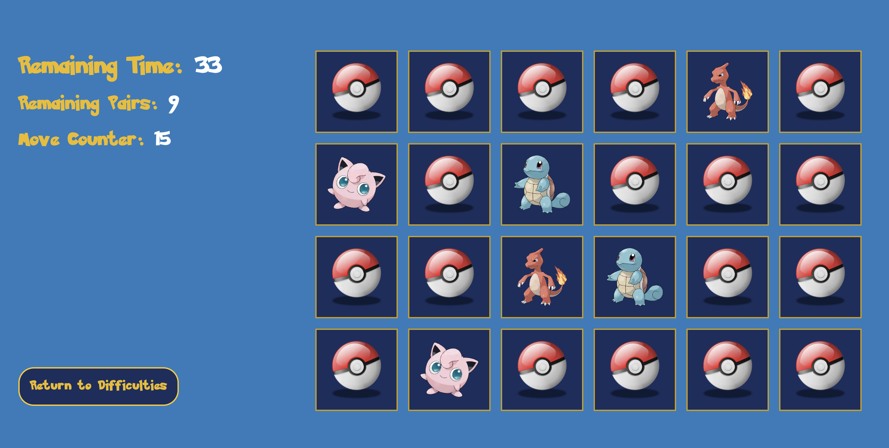
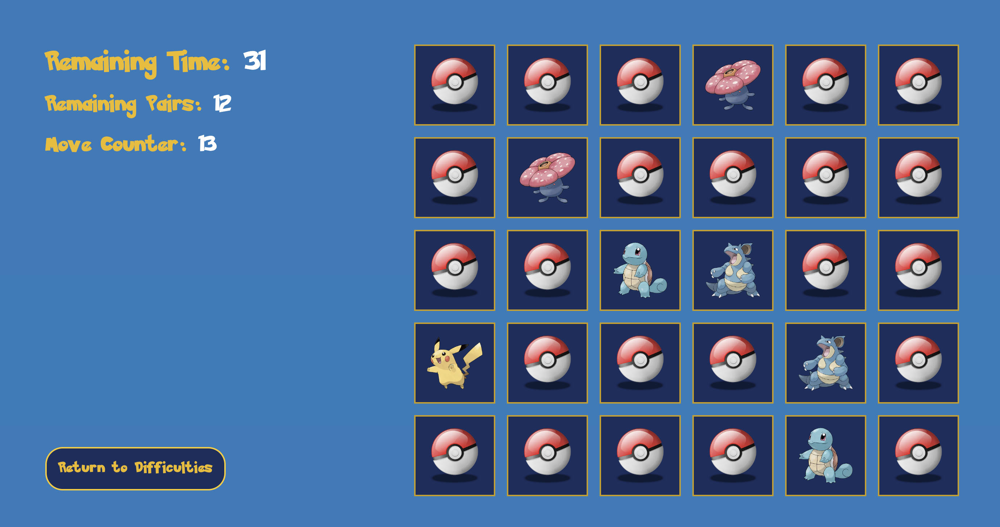

# Memory Game

Classic memory game with Pokémon theme. 

There are 3 difficulties and you have 60 seconds to beat each of them.

It is not possible to play very effectively on mobile devices, but for the sake of responsive design, it also looks decent on mobile.

Can you match the all Pokémons? Have fun!


## Authors

- [@ATErcan](https://www.github.com/ATErcan)
All codes in this project are written by me.


## Tech Stack

HTML, CSS, JavaScript, TypeScript, Next.js, Tailwind, react-confetti, nanoid


## Demo

https://ate-pokememory.vercel.app/









## Installation
All you need is to clone the project and install the dependencies
```bash
  $ git clone https://github.com/ATErcan/adRespect.git

  $ npm install
```
## 🔗 Links
[](https://ate-portfolio-next.vercel.app/)
[](https://www.linkedin.com/in/ahmet-talha-ercan/)


## Special Thanks

I would like to thank rviewer.io for inspiring me to create such a project.

## Appendix

On rviewer.io, when developers join a challenge, rviewer.io assigns them a repository to work on. Developers create branches, make commits and create pull requests in that repository.

However, this was my first challenge on rviewer.io and I wasn't aware of that. So, this project was originally developed on my personal repository. I added this repository as a remote origin so reviewers can track my development progress and commit history. But unfortunately, I couldn't create a pull request because, when I tried to do it, I've gotten an error as 'The branches that you're trying to merge have entirely different commit histories'. Because of that, I had to push the whole project directly to the main branch.
 
Aside from that, all my commits are here for you to review. Thank you for giving me a chance at this challenge.

# rviewer.io - Memory Game Challenge

Who hasn't played card games at some point? From a very young age to a beer night with friends, right?

Well, for this Challenge you will have to choose your favourite theme and recreate
the [famous game](https://en.wikipedia.org/wiki/Concentration_(card_game)).


> This is a challenge created by [MoureDev](https://www.twitch.tv/mouredev). He will review and give feedback to some
> proposed solutions from the community in one of his Twitch livestreams 😻 

**Surprise us! 😉**

## How it works?

The requirements for the game are pretty simple. First, you have to choose whatever theme you want to, like
Pokémon, Star Wars or even Peppa Pig!

The dynamics of the game will consist of presenting a board with a series of face-down cards and revealing all the pairs
before the time is up. The user will tap on each card to turn it over and, if two of them match when they are uncovered,
they will be turned face up. If not, they will be hidden again.

**The game is won if all pairs are uncovered within the time limit.**

So, the game will have an initial screen to select one of the three difficulties and 1 minute to solve each board:

* Easy: 4x4 board
* Medium: 4x6 board (or 6x4 depending on the screen)
* Difficult: 5x6 board (or 6x5 depending on screen)

The application will have a main game screen that contains the following elements:

* Game board. The board where the user will play and see the cards.
* Move counter. Every time 2 cards are turned over it will increase by 1, whether you hit or not.
* Time counter. A 1-min countdown to reveal all pairs!
* Remaining pairs counter.
* A button to return to the level selection screen.

## Technical requirements

* Create a **clean**, **maintainable** and **well-designed** code. We expect to see a good and clear architecture that
  allows to add or modify the solution without so much troubles.
* **Test** your code until you are comfortable with it. We don't expect a 100% of Code Coverage but some tests that
  helps to have a more stable and confident base code.

To understand how you take decisions during the implementation, **please write a COMMENTS.md** file explaining some of
the most important parts of the application. You would also be able to defend your code through
[Rviewer](https://rviewer.io), once you submit your solution.

---

## How to submit your solution

* Push your code to the `devel` branch - we encourage you to commit regularly to show your thinking process was.
* **Create a new Pull Request** to `main` branch & **merge it**.

Once merged you **won't be able to change or add** anything to your solution, so double-check that everything is as you
expected!

Remember that **there is no countdown**, so take your time and implement a solution that you are proud!

--- 

<p align="center">
  If you have any feedback or problem, <a href="mailto:help@rviewer.io">let us know!</a> 🤘
  <br><br>
  Made with ❤️ by <a href="https://rviewer.io">Rviewer</a>
</p>